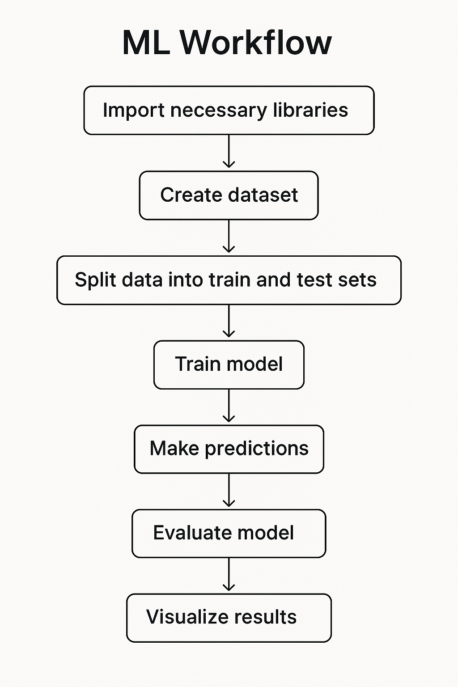

#  ML Fundamentals: Decision Tree Classifier Walkthrough

This repository contains a beginner-friendly walkthrough of a machine learning pipeline using a **Decision Tree Classifier**. The notebook is designed to help you build, understand, and visualize a simple ML model which is great for refreshing your fundamentals or onboarding new learners.

---

## Decision Tree Visualization



##  What's Inside

`DecisionTree.ipynb` covers the full ML workflow:
1. **Importing Libraries**  
2. **Creating a Synthetic Dataset**  
3. **Data Preprocessing** (feature/target selection, train-test split)  
4. **Model Training** using `DecisionTreeClassifier` from `sklearn`  
5. **Model Evaluation** with accuracy  
6. **Visualization** of the decision tree

---

##  Why This Notebook?

After 9 months of hands-on work in ML, I've realised the value of strong fundamentals. This notebook:
- Keeps things simple and clean
- Focuses on end-to-end model building
- Provides clear comments for learners
- Is designed to be run as-is with zero setup friction

If you're preparing for interviews, refreshing your basics, or mentoring others, this notebook can serve as a reliable starting point.

---

##  Getting Started

###  Requirements

- Python 3.x  
- pandas  
- scikit-learn  
- matplotlib  

Install dependencies (if needed):

```bash
pip install pandas scikit-learn matplotlib
